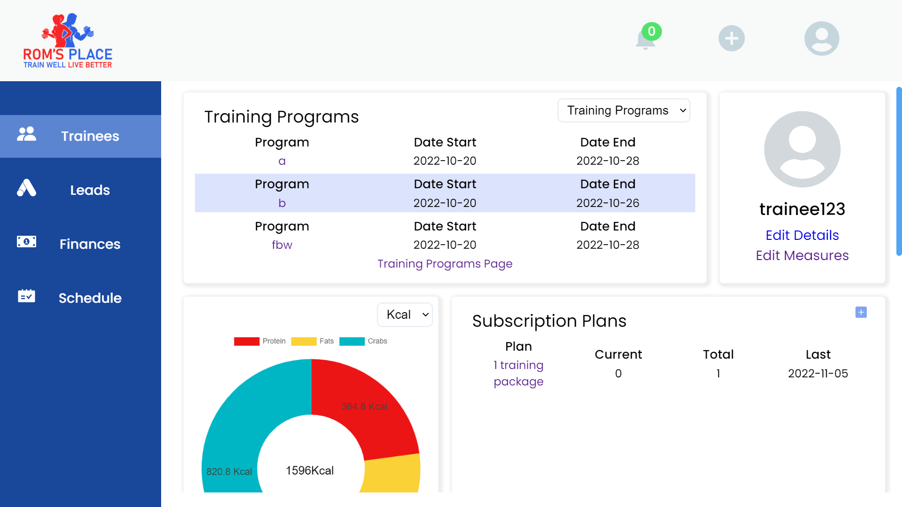

# My Trainees Management App v3:

Link to the app: [My Trainees Management App v3](https://my-trainees-management-v3.onrender.com/login):point_left:

**Demo accounts:** \
**Trainer:** \
username & password: trainer123 
\
**Trainee:**   \
username & password: trainee123 

## About my project:

My Trainees Management is a web application that assists
personal trainers in managing their business.
\
The app helps the trainer manage his trainee's training and nutrition programs, his leads and the business's finances.

## Why I chose this project:

As a self-employed personal trainer, I wanted to combine my passion for programming with the world of personal training. \
During my work, I have experienced difficulties managing my business due to needing a single app comprising all the tools I need.
\
Therefore, I've decided to create an app that overviews my trainees and their progress.

My Linkedin - [Rom Orlovich](https://www.linkedin.com/in/rom-orlovich/)

## Technologies:

- **[React](https://reactjs.org/)**
- **[TypeScript](https://www.typescriptlang.org/)**
- **[Sass](https://www.npmjs.com/package/sass)**
- **[Node.js](https://nodejs.org/en/)**
- **[PostgreSQL](https://www.postgresql.org/)**

## Packages:

- **Front-end** :

  - [Redux RTK & Query](https://www.npmjs.com/package/@reduxjs/toolkit) - For state and data-fetching management.
  - [React Router](https://www.npmjs.com/package/react-router-dom) - For routes management.
  - [React Hook Form](https://www.npmjs.com/package/react-hook-form) - For forms management.
  - [Yup](https://www.npmjs.com/package/yup) - For validation.
  - [React Icons](https://www.npmjs.com/package/react-icons) - For icons
  - [Full-Calender](https://fullcalendar.io/) -For calender display.
  

- **Back-end**:
  - [Express](https://www.npmjs.com/package/express)- For building the server.
  - [Node-postgres](https://www.npmjs.com/package/pg) - For DB management.
  - [Yup](https://www.npmjs.com/package/yup) - For validation.
  - [Webpack](https://www.npmjs.com/package/webpack) - For modules bundling of the server side.
  - [Dotenv](https://www.npmjs.com/package/dotenv) - For environment variables.
  - [Jsonwebtoken](https://www.npmjs.com/package/jsonwebtoken) - For generating tokens.
  - [Bycrpt](https://www.npmjs.com/package/bcryptjs) - For password hashing.
  - [Google API](https://www.npmjs.com/package/googleapis) - For Gmail service.
  - [Nodemailer](https://www.npmjs.com/package/nodemailer) - For sending emails.
  - [Date-fns](https://date-fns.org/)- For date manipulation.
  - [Winston-logger](https://www.npmjs.com/package/winston) -For server logs.
  

## Installation

1. **Clone the repo**
   ```
   git clone https://github.com/rom-orlovich/my-trainees-management.git
   ```
2. **Install all the dependencies**
   ```
   npm run init-p
   ```
3. **Run server**
   ```
   npm run server
   ```
4. **Run Client**

   ```
   npm run start
   ```

5. **Go to http://localhost:3000 and have fun**!

## Main Features:

1. **Modify App's Data** - Create/Read/Update/Delete the following data: Trainees, training programs, exercises, muscles group, equipment, leads, cities and locations.
2. **Table Pagination** - Shows when there are more than ten items.
3. **Filter Table's Rows By Name** - Filters the table's items by name.
4. **Autocomplete Search Input** - Suggests a list of results from the server. \
   Infinite scroll: When there are more than ten possible suggestions, the users can scroll and fetch more suggestions from the server.
5. **Notifications System** - Notifications display for various user activities.
6. **Users System** -
   - Multiple personal trainers able to log in and manage their business. 
   - Personal trainers can register new trainees to their system and send them an email to sign up and create users to track their progress. 
   - Each user role has different permission to access app resources. 
   - Persistent login system based on Refresh Token Rotation mechanism.
7. **Trainee & Trainer Profile Page** - The page display their personal account data.
8. **Statistics Page** - Personal trainers have a graphical overview of their business. \
     Trainees will have a graphical overview of their progress.
9. **Trainer & Trainee Schedule** - Personal Trainers can schedule new training and meeting sessions. \
    Trainees can watch their next sessions.

## Coming soon:
1. **Additional System Data** - Nutrition program's progress, financial system and suppliers.
2. **Food Nutrition API** - The app will interface with food API to build nutrition menus.


## Images: 
### Trainer's Profile


### Statistic Page Example


### Trainer Calander


### Trainee's Profile



### Trainee's Training Program


### Admin's Account 


### Trainee's Account 


